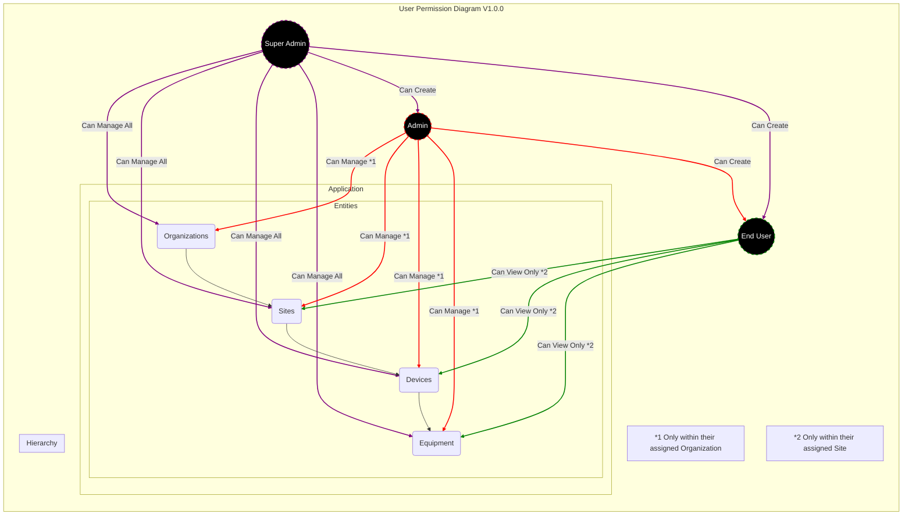

 

  </img>

# RTLS Kickstarter Application for TagoIO
This is a starter application to be used with TagoIO. It includes the main required features for a regular application to run, with functionality to facilitate setting up new sensors within the application. You can use the scripts provided here to learn or to develop your own solution with its foundations.

# Components
The application contains the following features:
* Two levels: Organization and Sites
* Three access levels: Application Administrator, Organization Administrator, and End User
* Setup alerts
* Generate reports
* Navigation between dashboards and Run sidebar buttons

## Easy Installation
You can quickly install the application in your account by using the Import tool:
* First, make sure your RUN is activated. Visit this [link](https://admin.tago.io/run/), click on "Start now", and then save the change.
* Go to your [profile settings](https://admin.tago.io/account/).
* Generate a Token in your profile, making sure to set the **expire time** to never.
* Copy the Token.
* Access the Import tool by [clicking here](https://import-application.tago.run/dashboards/info/63e698562df1360009606d71?anonymousToken=00000000-5bbc-b03b-667d-7a002e56664b).
* Keep all entities selected, paste your token in the account token field.
* Select your region.
* Press Import Application, and you should receive a notification in your account when it's completed.
* To access the application using TagoRUN, make sure to create a user using your TagoIO Developer account, adding the tag key **access** with the tag value **admin**.

### Easy Update
To easily update your application when a new version is available, you can repeat the previous step.
If you have made changes to the application, you can choose only the entities you want to update, such as only the analysis.

### Code Setup and Installation
Using this repository, you will be able to change and update the analysis in your account. This step is not required unless you plan to make changes to the code.
* Install [Node.JS](https://help.tago.io/portal/en/kb/articles/464-node-js).
* Download the repository.
* Open your terminal and access the folder of the repository.
* Run `npm install`.
* Generate an account-profile token at TagoIO **My Settings** -> **Your Profile** -> **Tokens**. Make sure to generate a token with `Expire at` set to never, or utilize the [TagoIO CLI](https://www.npmjs.com/package/@tago-io/cli) to deploy your scripts.
* Open the `build.ts` and replace `Your-Account-Profile-Token` with a token from your profile.
* Go back to your terminal and run the template with `npm run start build`.
* It should take a few minutes for the script to build and import all the analysis and dashboards to your account.

### Code Update
* Make sure you have the `build.ts` with your account profile token.
* Update the repository with the latest version.
* Go back to your terminal and run the template with `npm run start build`.
* It should take a few minutes for the script to build and import all the analysis and dashboards to your account.

### Key Dependencies
* @tago-io/sdk: TagoIO SDK for interacting with the platform
* axios: For making HTTP requests
* geolib: For geolocation calculations
* luxon: For date/time handling
* zod: For runtime type checking

### How to Learn from This Code
The source code is organized in the following structure:
* **src/analysis**: Contains the analysis scripts
* **src/lib**: Common utility functions
* **src/services**: Service-specific implementations
* **src/types.ts**: TypeScript type definitions

Each service is related to specific functionality within the application. The analysis folder contains each analysis that must be present in your account, while the lib folder contains useful functions commonly used between the scripts.

For additional information on how to set up TagoIO with this code, and all the TagoIO resources used, check the Kickstarter Guide documentation at [analysis-kickstarter-rtls/docs/Kickstarter-rtls-Guide](https://drive.google.com/file/d/1lVDIEDPzpl5UhLTXDuoujuDOu7QHZjuJ/view?usp=sharing).

### User Permissions Diagram

### Support
You can open an issue or question at [https://github.com/tago-io/analysis-rtls-demo/issues](https://github.com/tago-io/analysis-rtls-demo/issues).
